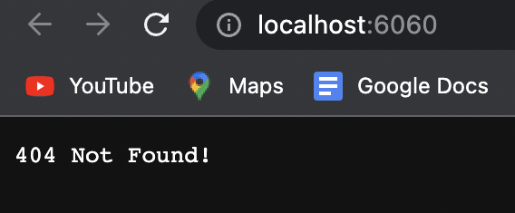
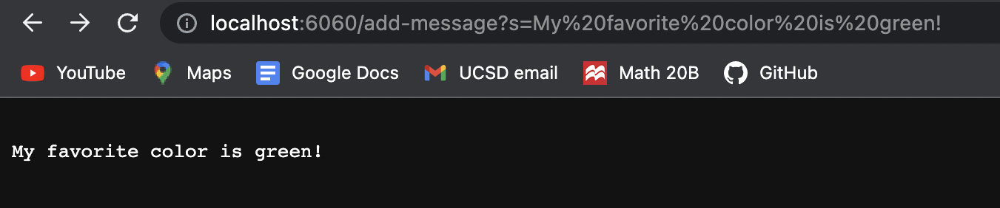
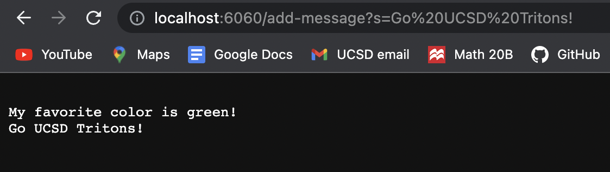

# SERVERS AND BUGS 
## Aaron Arellano

In this second lab report, we will be demonstrating the creation and function of webservers (week 2 lab), as well as the process of proper debugging for 
creating more efficient programs (week 3 lab). 

# Part #1 - String Server

Before we start the process of creating our own webserver, we must ask, what is a webserver? In essence, it is a server that accepts and reads 
website software and website information. This stored information can be the HTML files used to display the website, as well the as the CSS and
JavaScript code that provides the backend functionality for those websites.

The task in this report was to create a webserver that stored the strings inputted through the path of a given URL. The path will be in the given format.

```
/add-message?s=<string>
```

The path will act as a request to concatenate a new string line to the string variable listed in the StringServer.java class.
The code for my personal StringServer program is shown below.

```
import java.io.IOException;
import java.net.URI;

class Handler implements URLHandler {
    // The one bit of state on the server: a number that will be manipulated by
    // various requests.
    String message = "";

    public String handleRequest(URI url) {
        if(url.getPath().contains("/add-message")){
            String[] args = url.getQuery().split("=");
            String stringToAdd = args[1];
            message+= "\n"+ stringToAdd;
            return message;
        }
        return "404 Not Found!";
    }
}

public class StringServer {
    public static void main(String[] args) throws IOException{
        if(args.length == 0){
            System.out.println("Missing port number! Try any number between 1024 to 49151");
            return;
        }

        int port = Integer.parseInt(args[0]);

        Server.start(port, new Handler());
    }
}

```

After compiling and running the file (with port number 6060), via the lines
```
javac StringServer.java
java StringServer 6060
```
I then proceeded to launch the URL server, giving me the default message of 404 Not Found.



## StringServer example 1



In the first example above, I used the string *My favorite color is Green!* in the query of the URL. This String was then added to the String **message**
variable in the handler class, which is utilized by the String Server class.

1. Which methods were called? - In the beginning from the main method of the string server class, the start method is called from the server.java class, which
was a class provided in the github course wavelet repository.From within the server class, there is a method call to the handle request method found 
in the Handler class, which reads the URL path and stores the string inputs into the message string variable.

2. What are the arguments to those methods? The values of any class fields? - When the start method is called from the server class, the int port
argument is the port number we put when running StringServer (in my example it was 6060), and the second argument was a handler object. Within
the Handler class, the string message field variable is just an empty string. When the handleRequest method is called from the server, it's argument is
a URI object, which contains the url of the website we launched.This url is then scanned for the contents of its path and query.

3. How do the values of class fields change as a result of the request shown in the picture? Because the handle request method concluded that the url had
a path with the /add-message string in it, the method then split the query and got the string, which read **My favorite color is Green!**. It then 
concatenated a new line to the initially empty string and the added the phrase to the string message field variable. At the end, the message variable 
says My favorite color is green and displays that onto the website when the string is returned at the end of the handle request call.

## StringServer example 2



In this example, I used the string *Go UCSD Tritons!* as the new query input in the url. This string is added to the message variable that was altered by 
the previous example.

1. Which methods were called? Since we are adding onto a server that was already created in the previous example (with port 6060), the main method in
string server is not being called. Instead, since we are just retyping in the url address except with a different string, it is the handle request method 
being called. This method splits the url into the path and query and then reads the string that I inputted into the new url.

2. What are the arguments to those methods? The values of any class fields? When calling the handeRequest method, it takes in the url that I typed
in in the form of a URI object, which was created with the server class. The value of the string message field variable initially displays,

```
My favorite color is green!
```

3. How do the values of the class fields change as a result of the request in the new url? Because in the new url I wrote the string **Go UCSD Tritons!**, this new query was read by the handleRequest method in the Handler class, which took in the new url. Consequently, the new string was added to the
message field variable, along with a new line via \n. In the end, the message variable has the content *My favorite color is green! Go UCSD Tritons!*, as
shown in the picture of the example.


# Part #2 - Bugs and Debugging

For this section of the lab, I chose to analyze the reversed method in the ArrayExamples.java class. What the method is supposed to do is return a new
array with the elements of the input array in reversed order. The method as it was initially written can be seen below.

```
static int[] reversed(int[] arr) {
    int[] newArray = new int[arr.length];
    for(int i = 0; i < arr.length; i += 1) {
      arr[i] = newArray[arr.length - i - 1];
    }
    return arr;
  }
```

However, this method does not correctly reverse the contents of the input array *arr*. An input that produces an incorrect result can be seen with the
JUnit test below.

```
@Test
  public void testReversed1() {
    int[] input1 = {1,2,3,4,5};
    assertArrayEquals(new int[]{5,4,3,2,1}, ArrayExamples.reversed(input1));
  }
```

This method can produce correct output and pass tests only for certain inputs. An example of an input that doesn't produce failure is shown with the
following JUnit test.

```
@Test
  public void testReversed2() {
    int[] input1 = { };
    assertArrayEquals(new int[]{ }, ArrayExamples.reversed(input1));
  }
```

The symptoms of these inputs can be seen when compiling and running the JUnit tests and checking the terminal output (shown below).


